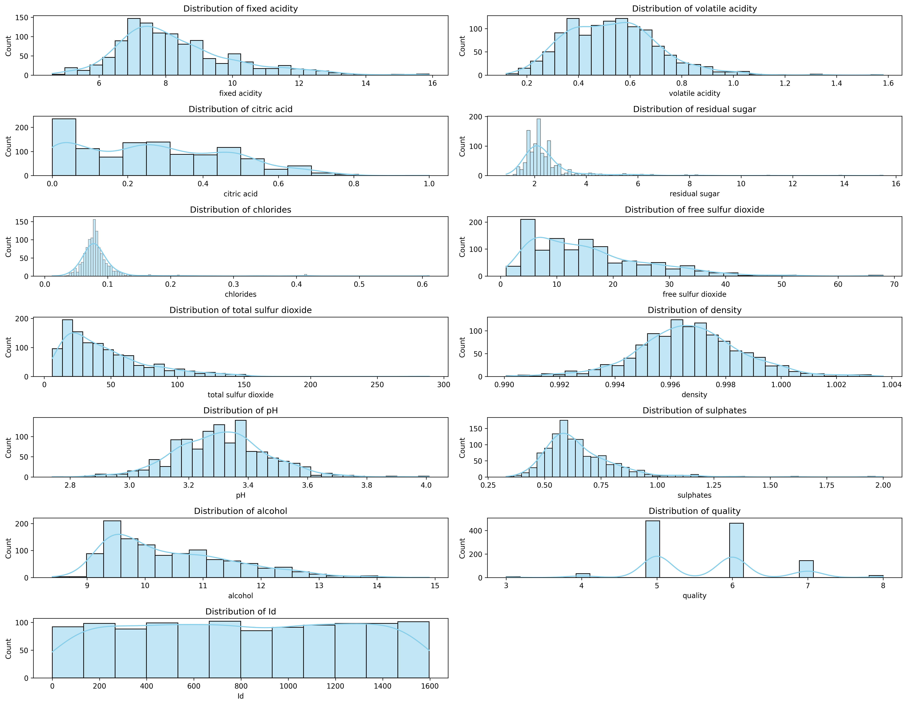
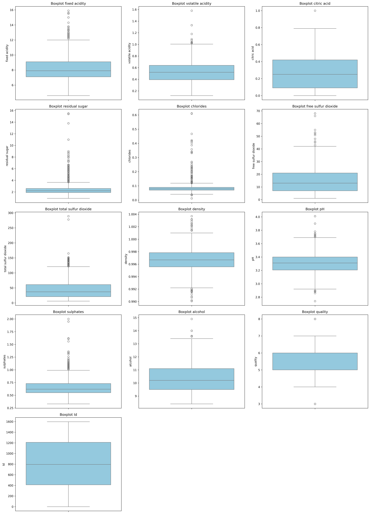
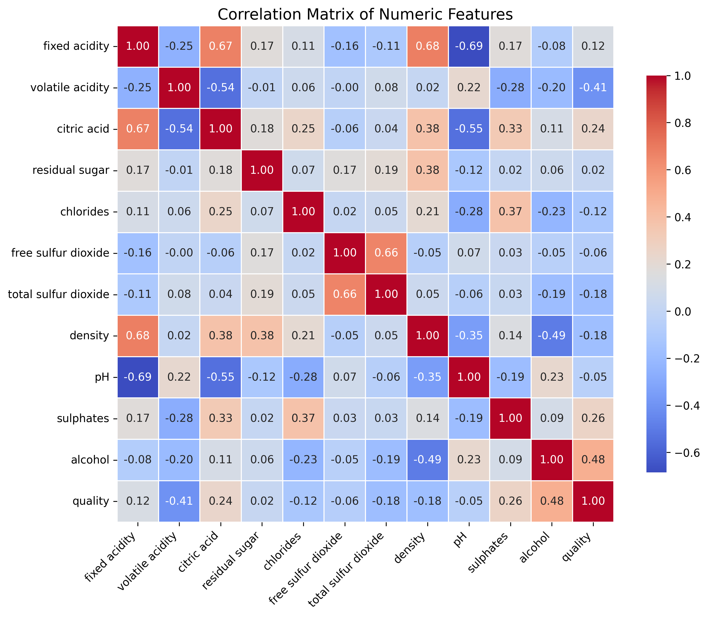
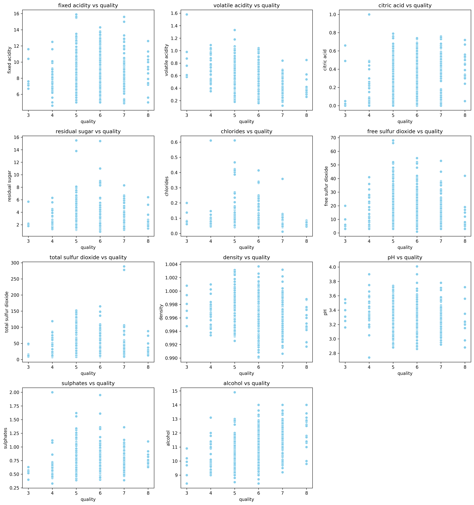
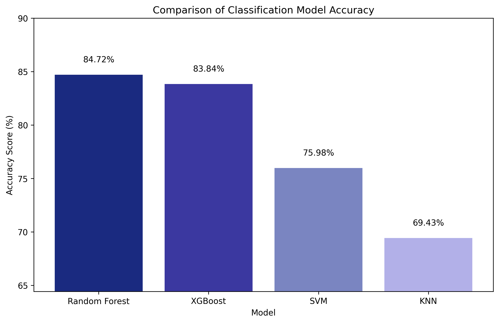

### Laporan Proyek Machine Learning - Atifa Fiorenza

### Domain Proyek
Kualitas wine merupakan salah satu faktor penentu nilai jual dan daya saing produk di industri minuman beralkohol. Penilaian kualitas biasanya dilakukan melalui uji rasa (sensory evaluation) oleh panelis terlatih. Meski metode ini lazim digunakan, prosesnya memerlukan waktu, biaya, dan tetap memiliki unsur subjektivitas.

Penelitian Cortez et al. (2009) menunjukkan bahwa kualitas wine dapat dimodelkan secara objektif menggunakan parameter fisikokimia seperti fixed acidity, volatile acidity, citric acid, kadar alkohol, dan kadar gula sisa (residual sugar). Melalui pendekatan data mining dan machine learning, hubungan antara variabel-variabel kimia ini dengan penilaian kualitas wine dapat dianalisis, sehingga memungkinkan prediksi kualitas tanpa harus melalui pengujian rasa manual.

Dataset yang digunakan pada proyek ini berasal dari penelitian tersebut dan berfokus pada red wine “Vinho Verde” asal Portugal. Dengan memanfaatkan teknik klasifikasi seperti Logistic Regression, Random Forest, XGBoost, SVM, dan KNN, diharapkan dapat dibangun model prediksi yang membantu produsen wine dalam mengontrol kualitas produk secara cepat, efisien, dan terukur berdasarkan parameter kimiawi yang mudah diukur di laboratorium.

Referensi:
Cortez, P., Cerdeira, A., Almeida, F., Matos, T., & Reis, J. (2009). Modeling wine preferences by data mining from physicochemical properties. Decision Support Systems, 47(4), 547–553.

----

### Business Understanding
Menilai kualitas wine secara cepat dan akurat membantu produsen mempercepat distribusi produk berkualitas tinggi, meningkatkan penjualan, dan menjaga reputasi merek.
Bagi konsumen, hal ini memastikan kualitas yang konsisten dan memuaskan.
Dengan machine learning, penilaian dapat dilakukan secara objektif dan efisien hanya berdasarkan data fisikokimia wine, tanpa bergantung pada penilaian manual yang subjektif.
##### Problem Statements
1. Apakah terdapat hubungan signifikan antara parameter fisikokimia wine (misalnya fixed acidity, volatile acidity, citric acid, alkohol) dan kualitas wine?
2. Bagaimana cara memprediksi kualitas red wine secara akurat hanya dengan menggunakan data kimiawi?
3. Algoritma klasifikasi mana yang memberikan performa terbaik untuk prediksi kualitas wine?

##### Goals
1. Menemukan fitur kimia yang paling berpengaruh terhadap kualitas wine.
2. Mengembangkan model prediksi kualitas wine berbasis data fisikokimia dengan akurasi tinggi.
3. Membandingkan beberapa algoritma klasifikasi untuk menentukan model dengan performa terbaik. 

##### Solution Statement
1. Melakukan analisis korelasi dan uji statistik untuk mengidentifikasi fitur kimia yang berpengaruh signifikan terhadap kualitas wine.
2. Membangun dan melatih model klasifikasi menggunakan algoritma seperti Random Forest, XGBoost, SVM, dan KNN.
3. Membandingkan hasil akurasi dari 4 model yang di latih

---

### Data Understanding

Dataset yang digunakan dalam proyek ini adalah **Wine Quality Dataset** yang tersedia di Kaggle, bersumber dari *UCI Machine Learning Repository*. Dataset ini dapat diakses melalui tautan berikut: [https://www.kaggle.com/datasets/yasserh/wine-quality-dataset/data](https://www.kaggle.com/datasets/yasserh/wine-quality-dataset/data).

Dataset ini berisi 12 fitur fisikokimia, dengan `quality` sebagai variabel target yang berisi nilai mulai dari 3 - 8, Dataset ini berisi 1143 data 

Berikut adalah daftar fitur pada dataset:

  * `fixed acidity`: Keasaman total dalam *wine* (g/dm³).
  * `volatile acidity`: Jumlah asam asetat dalam *wine* (g/dm³).
  * `citric acid`: Jumlah asam sitrat (g/dm³), yang memberikan rasa segar.
  * `residual sugar`: Gula yang tersisa setelah fermentasi (g/dm³), menentukan tingkat kemanisan.
  * `chlorides`: Jumlah garam dalam *wine* (g/dm³).
  * `free sulfur dioxide`: Bagian dari SO2 yang bebas.
  * `total sulfur dioxide`: Jumlah total SO2.
  * `density`: Kepadatan *wine* (g/cm³).
  * `pH`: Tingkat keasaman *wine*.
  * `sulphates`: Kalium sulfat (g/dm³), berperan sebagai pengawet.
  * `alcohol`: Kandungan alkohol dalam *wine* (%).
  * `quality`: Kualitas *wine* yang telah diklasifikasikan menjadi low (0) atau high (1).

---
### Data Visualization 

#### Univariate Analysis

Berdasarkan hasil histogram di atas, beberapa fitur seperti residual sugar, chlorides, free sulfur dioxide, total sulfur dioxide, dan alcohol miring ke kanan, menunjukkan adanya beberapa nilai yang sangat tinggi (outlier). Fitur seperti volatile acidity, density, dan pH memiliki distribusi yang lebih simetris seperti kurva lonceng. Fitur quality merupakan fitur kategorikal dengan nilai yang terpusat di 5, 6, dan 7, sehingga histogram lebih cocok untuk menampilkannya. Sedangkan fitur Id tidak berguna untuk analisis karena setiap nilainya unik.

Berdasarkan hasil boxplot, semua fitur memiliki outlier yang terlihat dari titik-titik di luar whisker. Beberapa fitur seperti **residual sugar, chlorides, free sulfur dioxide, dan total sulfur dioxide memiliki jumlah outlier yang banyak**, sedangkan fitur seperti **alcohol, sulphates, fixed acidity, volatile acidity, density, citric acid, pH, dan quality memiliki outlier lebih sedikit**. Hal ini perlu diperhatikan saat preprocessing untuk mengurangi dampak negatif outlier terhadap model.

#### Multivariate Analysis

Beberapa fitur menunjukkan hubungan kuat satu sama lain. **Fixed acidity berkorelasi positif dengan citric acid dan density**, sedangkan **citric acid berkorelasi negatif dengan pH**. Volatile acidity cenderung menurunkan citric acid dan kualitas wine. Free sulfur dioxide dan total sulfur dioxide saling berkorelasi tinggi. Alkohol memiliki korelasi positif dengan kualitas wine, artinya wine dengan alkohol lebih tinggi biasanya lebih baik. Secara umum, fitur seperti alkohol, fixed acidity, citric acid, dan sulfur dioxide penting untuk memprediksi kualitas wine, sementara fitur lain pengaruhnya lebih kecil.

Berdasarkan scatter plot, beberapa fitur menunjukkan pengaruh terhadap kualitas wine. **Alcohol, citric acid, dan sulphates memiliki hubungan positif**, artinya semakin tinggi nilai fitur-fitur ini, semakin baik quality wine. Sebaliknya, **volatile acidity dan density memiliki hubungan negatif**, sehingga peningkatan keduanya cenderung menurunkan kualitas. Sementara itu, fitur seperti **fixed acidity, residual sugar, chlorides, free dan total sulfur dioxide, serta pH tidak menunjukkan pola yang jelas**, menandakan korelasinya dengan quality sangat lemah atau hampir tidak ada.

### Data Preparation
Pada tahap ini, beberapa teknik persiapan data dilakukan untuk memastikan data siap digunakan dalam pemodelan:

1. **Copy Data** : Menyimpan data ke variabel **clean_df** data agar nilai asli dan data yang mau dipakai modelling tidak tercampur.
2. Menghilangkan nilai yang duplikat pada dataset. Tahapan ini diperlukan untuk mengurangi bias dan mencegah overfitting dari model.
3.  **Penanganan *Outlier***: Nilai-nilai ekstrem (`volatile acidity`, `residual sugar`, `chlorides`, `free sulfur dioxide`, `total sulfur dioxide`, dan `sulphates`) diatasi menggunakan teknik **Winsorizing**. Teknik ini mengganti nilai yang berada di luar batas tertentu (misalnya, persentil 5 dan 95) dengan nilai ambang batas tersebut.
4. **Konversi Data**: Melakukan konversi fitur quality dari rentang `0-10` menjadi data kategorikal yaitu `low`,`medium`, dan `high`, dan kemudian di encode kembali. Tahapan ini dilakukan karena tujuan dari proyek ini adalah melakukan **klasifikasi multi-kelas** dengan 3 kelas dan agar lebih mudah dalam menggeneralisasi kualitas red wine.
5. Drop column `Id` karena data id unik sehingga tidak perlu dipakai saat modelling
6.  **Pembagian Data**: Data dibagi menjadi data pelatihan (*training*) dan data pengujian (*testing*) dengan rasio 80:20 untuk membangun dan mengevaluasi model.
7.  **Penanganan Ketidakseimbangan Kelas (*Imbalanced Data*)**: Karena distribusi kelas quality tidak seimbang dimana data 0: 9, 1: 945, dan 2:159, teknik **SMOTE (*Synthetic Minority Over-sampling Technique*)** diterapkan pada data pelatihan. SMOTE menghasilkan sampel sintetis untuk kelas minoritas, sehingga jumlah sampel di setiap kelas menjadi seimbang.
8.  **Standarisasi Fitur**: Menggunakan `RobustScaler` untuk menstandarisasi fitur-fitur numerik pada data. Proses ini penting untuk model yang sensitif terhadap skala fitur, seperti `KNN` dan `SVM`, sehingga semua fitur memiliki rentang nilai yang seragam.

-----

### Modeling
Pada tahap ini, 4 model klasifikasi *machine learning* diterapkan untuk menyelesaikan masalah yang telah didefinisikan. Alasan pemilihan keempat model ini karena masing-masing punya keunggulan yang berbeda, sehingga bisa dibandingkan performanya dan dipilih yang paling sesuai untuk dataset wine:

1. `Random Forest` : Model *ensemble* berbasis pohon keputusan yang membangun banyak pohon secara paralel.
  - Mudah digunakan dan tahan terhadap overfitting.
  - Bagus untuk data dengan banyak fitur numerik dan bisa menilai feature importance.
  - Memberikan baseline yang kuat untuk masalah klasifikasi.
2. `XGBoost`: Model *ensemble* yang membangun pohon keputusan secara sekuensial dengan setiap pohon baru berusaha memperbaiki kesalahan dari pohon sebelumnya.
  - Sering menghasilkan performa tinggi karena fokus memperbaiki kesalahan model sebelumnya.
  - Cocok untuk dataset yang kompleks atau memiliki interaksi antar fitur.
  - XGBoost lebih cepat dan efisien dibanding Gradient Boosting biasa, dengan regularisasi untuk mengurangi overfitting.
3. `SVM` (Support Vector Machine) : Model yang mencari *hyperplane* optimal untuk memisahkan kelas.
  - Efektif untuk dataset berdimensi tinggi.
  - Dapat memisahkan kelas dengan baik, bahkan jika hubungan antar fitur non-linear (dengan kernel trick).
  - Memberikan pendekatan yang berbeda dibanding pohon keputusan (tree-based).
4. `KNN` (K-Nearest Neighbors) : Model non-parametrik yang mengklasifikasikan data berdasarkan mayoritas kelas dari tetangga terdekatnya.
  - Model sederhana dan intuitif, berbasis jarak antar data.
  - Berguna sebagai perbandingan dengan model yang lebih kompleks.
  - Tidak membuat asumsi distribusi data sehingga bisa menangani pola yang berbeda.

Dengan membandingkan performa mereka, kita bisa menentukan model terbaik untuk prediksi kualitas wine.
  
-----

### Evaluation
Metrik evaluasi yang dihitung untuk setiap model meliputi Akurasi, Precision, Recall, dan F1-Score. Namun, untuk tujuan perbandingan performa antar model, fokus utama adalah nilai akurasi. Dengan membandingkan akurasi, kita dapat menentukan model mana yang paling efektif dalam memprediksi kualitas wine, meskipun metrik lain tetap tersedia sebagai informasi tambahan

  * **Akurasi**: Persentase prediksi yang benar dari total prediksi.
  * **Precision**: Kemampuan model untuk tidak mengklasifikasikan sampel negatif sebagai positif.
  * **Recall**: Kemampuan model untuk menemukan semua sampel positif.
  * **F1-Score**: Rata-rata harmonik dari *precision* dan *recall*, memberikan keseimbangan antara keduanya.

**Hasil Proyek Berdasarkan Metrik Evaluasi Akurasi:**

===== Random Forest =====
Score: 0.8472

              precision    recall  f1-score   support

         Low       0.11      0.12      0.12         8
      Medium       0.93      0.88      0.90       189
        High       0.64      0.84      0.73        32

    accuracy                           0.85       229
   macro avg       0.56      0.62      0.58       229
weighted avg       0.86      0.85      0.85       229

==== XGBoost =====
Score: 0.8384

              precision    recall  f1-score   support

         Low       0.10      0.12      0.11         8
      Medium       0.92      0.88      0.90       189
        High       0.64      0.78      0.70        32

    accuracy                           0.84       229
   macro avg       0.55      0.59      0.57       229
weighted avg       0.85      0.84      0.84       229

===== SVM =====
Score: 0.7598

              precision    recall  f1-score   support

         Low       0.04      0.12      0.06         8
      Medium       0.92      0.78      0.84       189
        High       0.58      0.81      0.68        32

    accuracy                           0.76       229
   macro avg       0.51      0.57      0.53       229
weighted avg       0.84      0.76      0.79       229

===== KNN =====
Score: 0.6943

              precision    recall  f1-score   support

         Low       0.06      0.25      0.09         8
      Medium       0.95      0.67      0.79       189
        High       0.51      0.94      0.66        32

    accuracy                           0.69       229
   macro avg       0.50      0.62      0.51       229
weighted avg       0.86      0.69      0.74       229

Berdasarkan tabel evaluasi dan grafik akurasi, model **Random Forest** adalah yang paling baik dengan akurasi tertinggi sebesar **85%**. Model ini merupakan yang paling seimbang, meskipun semua model termasuk Random Forest dan XGBoost mengalami kesulitan signifikan dalam memprediksi kelas 0. Hal ini terlihat dari nilai precision, recall, dan F1-score yang sangat rendah untuk kelas tersebut. Model SVM dan KNN adalah yang paling lemah, dengan akurasi keseluruhan lebih rendah, dan juga mengalami kesulitan dalam prediksi, terutama untuk kelas 0 dan 1. Untuk meningkatkan performa secara keseluruhan, penting untuk menangani prediksi yang buruk pada kelas 0, kemungkinan disebabkan oleh ketidakseimbangan data.

**Kesimpulan**: Dengan ini kita bisa menjawab pertanyaan problem state yang ada di atas dimana 
1. Apakah terdapat hubungan signifikan antara parameter fisikokimia wine (misalnya fixed acidity, volatile acidity, citric acid, alkohol) dan kualitas wine?
Ya, terutama pada fitur seperti `alkohol`, `fixed acidity`, `citric acid`, dan `sulfur dioxide` penting untuk memprediksi kualitas wine, sementara fitur lain pengaruhnya lebih kecil.

2. Bagaimana cara memprediksi kualitas red wine secara akurat hanya dengan menggunakan data kimiawi?
Dengan melakukan proses data serta modelling dengan 4 model yang sudah disebutkan diatas dan melakukan evaluasi

3. Algoritma klasifikasi mana yang memberikan performa terbaik untuk prediksi kualitas wine?
Algoritma `Random Forest` yang performanya baik yaitu sekitar **85%**
----

### Saran 
1. Eksplorasi Lanjutan: Pertimbangkan untuk mencoba model boosting seperti XGBoost dengan tuning yang lebih dalam dan eksplorasi feature engineering.
2. Implementasi: Setelah model final didapat, model tersebut dapat di-deploy untuk membantu produsen wine dalam mengontrol kualitas produk secara otomatis.

